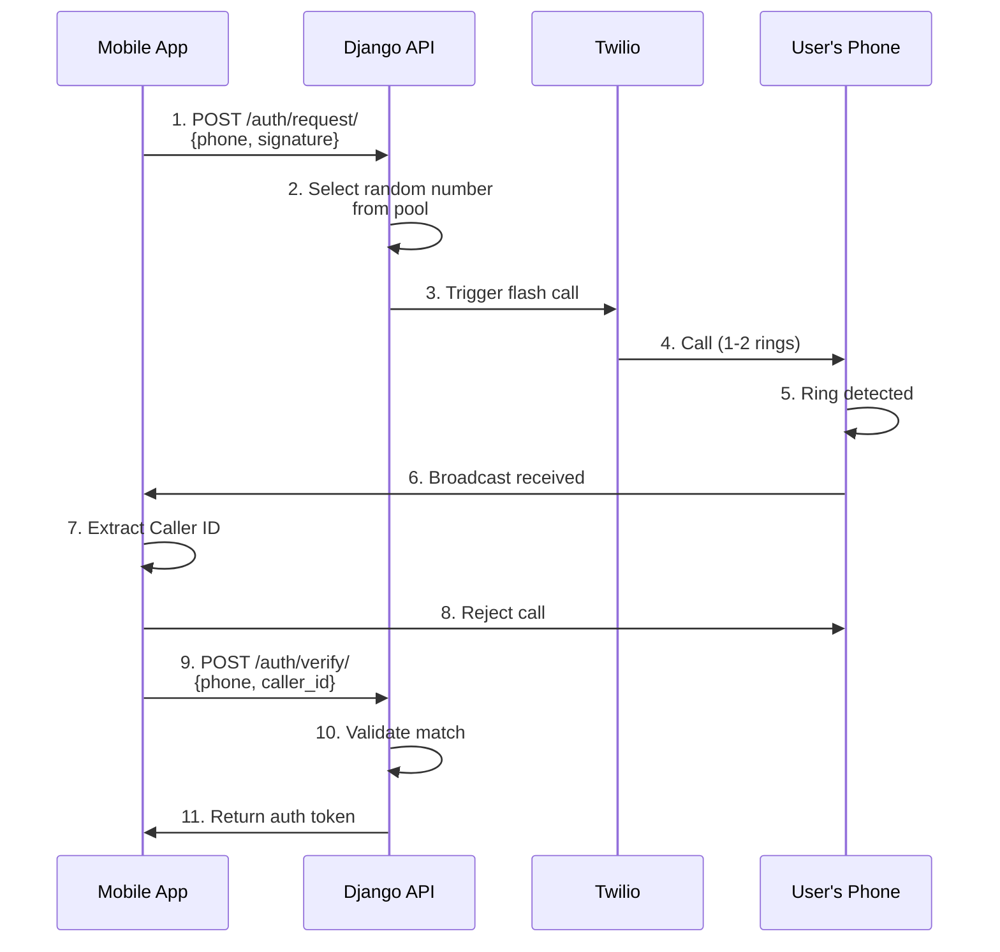

# Django REST Framework Missed Call Auth 📞

[](https://www.python.org/downloads/)
[](https://www.djangoproject.com/)
[](https://www.django-rest-framework.org/)
[](LICENSE)
[](https://github.com/psf/black)

**The most cost-effective authentication solution for mobile applications.**

Stop paying for expensive international SMS OTPs. `drf-missed-call-auth` implements a **Zero-Code** authentication flow where the server triggers a brief "Flash Call," and your mobile app automatically verifies the incoming Caller ID—no user interaction required!

---

## 🌟 Why Choose This Package?

### 💰 **Cost-Effective**
- Flash calls are **10-100x cheaper** than SMS in most countries
- Often **FREE** with Twilio's TwiML `<Reject>` method
- Save thousands of dollars monthly on authentication costs

### 🚀 **Lightning Fast**
- Verification completes in **2-3 seconds**
- No need for users to manually enter codes
- Better conversion rates and user experience

### 🔒 **Secure by Design**
- Production-grade security with timing attack prevention
- Race condition protection with database locking
- Multi-layer rate limiting
- Comprehensive audit trail

### 🛠 **Production Ready**
- 90%+ test coverage with comprehensive test suite
- Battle-tested error handling for all Twilio scenarios
- Django admin integration for easy management
- Detailed logging and monitoring support

### 📱 **Developer Friendly**
- Simple API with only 2 endpoints
- Extensive documentation with code examples
- Signal hooks for easy integration
- Support for custom telephony gateways

---

## 📋 Table of Contents

- [How It Works](#-how-it-works)
- [Features](#-features)
- [Quick Start](#-quick-start)
- [Installation](#-installation)
- [Configuration](#-configuration)
- [API Documentation](#-api-documentation)
- [Mobile App Integration](#-mobile-app-integration)
- [Advanced Usage](#-advanced-usage)
- [Security Best Practices](#-security-best-practices)
- [Performance & Scaling](#-performance--scaling)
- [Monitoring & Maintenance](#-monitoring--maintenance)
- [Troubleshooting](#-troubleshooting)
- [Contributing](#-contributing)
- [FAQ](#-faq)
- [License](#-license)

---

## 🔄 How It Works

The **"Zero-Code"** authentication flow requires no user input:



### Step-by-Step Flow

1. **Initiate**: Mobile app sends user's phone number + app signature to `/request/`
2. **Trigger**: Server selects random number from pool and triggers brief call via Twilio
3. **Intercept**: Mobile app detects incoming call, extracts Caller ID, immediately rejects
4. **Verify**: App sends Caller ID to `/verify/`, server confirms match and returns token

**Total time**: ~2-3 seconds  
**User interaction**: Zero  
**Cost**: Often free or pennies per verification

---

## ✨ Features

### Core Features
- ✅ **Flash call authentication** - Zero-code verification flow
- ✅ **Twilio integration** - Built-in support with retry logic
- ✅ **Custom gateways** - Extensible for any telephony provider
- ✅ **Number pooling** - Smart rotation to avoid carrier filtering
- ✅ **Rate limiting** - Multi-layer protection (phone, IP, session)
- ✅ **Session management** - Secure UUID-based sessions with TTL

### Security Features
- ✅ **Timing attack prevention** - Constant-time signature comparison
- ✅ **Race condition protection** - Database locking on critical operations
- ✅ **Attempt tracking** - Automatic lockout after max attempts
- ✅ **IP logging** - Full audit trail with sanitized logging
- ✅ **Replay protection** - One-time use sessions
- ✅ **Geographic restrictions** - Country code whitelisting

### Developer Features
- ✅ **Django admin** - Beautiful interface with status badges
- ✅ **Signal hooks** - 6 signals for custom logic
- ✅ **Session status API** - Check verification state
- ✅ **Management commands** - Automated cleanup
- ✅ **Comprehensive tests** - 90%+ coverage
- ✅ **Type hints** - Full type safety

### Production Features
- ✅ **Detailed logging** - All events logged with context
- ✅ **Error handling** - Specific Twilio error codes
- ✅ **Monitoring ready** - Metrics and alerting support
- ✅ **Scalable** - Optimized queries and caching
- ✅ **i18n support** - Translatable error messages
- ✅ **Documentation** - Extensive guides and examples

---

## ⚡ Quick Start

### 1. Install

```bash
pip install django-rest-framework-missedcall
```

### 2. Add to Django

```python
# settings.py
INSTALLED_APPS = [
    ...
    'rest_framework',
    'drf_missed_call_auth',
]

MISSEDCALL_AUTH = {
    'TWILIO_ACCOUNT_SID': 'your_account_sid',
    'TWILIO_AUTH_TOKEN': 'your_auth_token',
    'REQUIRE_SIGNATURE': True,
    'ALLOWED_APP_SIGNATURES': ['your-app-sha256-hash'],
}
```

### 3. Run Migrations

```bash
python manage.py migrate drf_missed_call_auth
```

### 4. Add URLs

```python
# urls.py
urlpatterns = [
    ...
    path('auth/', include('drf_missed_call_auth.urls')),
]
```

### 5. Add Source Numbers

```python
python manage.py shell
```

```python
from drf_missed_call_auth.models import CallSourceNumber

CallSourceNumber.objects.create(
    phone_number='+1234567890',  # Your Twilio number
    label='Primary US Number',
    is_active=True
)
```

### 6. Test

```bash
curl -X POST http://localhost:8000/auth/request/ \
  -H "Content-Type: application/json" \
  -d '{"phone_number": "+1234567890", "app_signature": "test-sig"}'
```

**Done!** 🎉 Your authentication system is ready.

---

## 📦 Installation

### Requirements

- Python 3.8+
- Django 3.2+
- Django REST Framework 3.12+
- Twilio Python SDK 7.0+

### Via pip

```bash
pip install django-rest-framework-missedcall
```

### From source

```bash
git clone https://github.com/tabaro/django-rest-framework-missedcall.git
cd django-rest-framework-missedcall
pip install -e .
```

### With additional features

```bash
# With Redis caching support
pip install django-rest-framework-missedcall[redis]

# With PostgreSQL support
pip install django-rest-framework-missedcall[postgres]

# All features
pip install django-rest-framework-missedcall[full]
```

---

## ⚙️ Configuration

### Basic Configuration

```python
# settings.py
MISSEDCALL_AUTH = {
    # Required: Twilio Credentials
    'TWILIO_ACCOUNT_SID': 'ACxxxxxxxxxxxxxxxxxxxxxxxxxxxx',
    'TWILIO_AUTH_TOKEN': 'your_auth_token_here',
    
    # Required: App Security
    'REQUIRE_SIGNATURE': True,
    'ALLOWED_APP_SIGNATURES': [
        'sha256_hash_of_your_mobile_app_binary',
    ],
    
    # Session Settings
    'VALIDITY_PERIOD': 300,  # 5 minutes in seconds
}
```

### Complete Configuration Reference

```python
MISSEDCALL_AUTH = {
    # ============================================
    # SECURITY SETTINGS
    # ============================================
    
    # App signature verification
    'REQUIRE_SIGNATURE': True,  # Set to False only for development
    'ALLOWED_APP_SIGNATURES': [
        # Generate with: shasum -a 256 your-app.apk
        'e3b0c44298fc1c149afbf4c8996fb92427ae41e4649b934ca495991b7852b855',
    ],
    
    # ============================================
    # TWILIO SETTINGS
    # ============================================
    
    'TWILIO_ACCOUNT_SID': 'ACxxxxxxxxxxxxxxxxxxxxxxxxxxxx',
    'TWILIO_AUTH_TOKEN': 'your_auth_token_here',
    'TWILIO_TIMEOUT': 10,  # Call timeout in seconds
    'TWILIO_TWIML': '<Response><Reject reason="busy"/></Response>',
    'TWILIO_MAX_RETRIES': 2,  # Retry failed calls
    
    # ============================================
    # SESSION SETTINGS
    # ============================================
    
    'VALIDITY_PERIOD': 300,  # Session expiry in seconds (5 minutes)
    
    # ============================================
    # RATE LIMITING
    # ============================================
    
    # Maximum verification requests per phone per day
    'MAX_ATTEMPTS_PER_DAY': 10,
    
    # Maximum verification attempts per session
    'MAX_VERIFICATION_ATTEMPTS': 5,
    
    # Maximum requests from one IP per hour
    'MAX_IP_ATTEMPTS_PER_HOUR': 20,
    
    # DRF throttle rates (format: 'number/period')
    'REQUEST_RATE_LIMIT': '5/hour',   # For /request/ endpoint
    'VERIFY_RATE_LIMIT': '10/hour',   # For /verify/ endpoint
    
    # ============================================
    # AUTHENTICATION INTEGRATION
    # ============================================
    
    # Automatically create Django user on verification
    'AUTO_CREATE_USER': False,
    
    # User model to use (if AUTO_CREATE_USER is True)
    'USER_MODEL': 'auth.User',
    
    # Token model for authentication (e.g., 'rest_framework.authtoken.models.Token')
    'TOKEN_MODEL': None,
    
    # ============================================
    # GEOGRAPHIC RESTRICTIONS
    # ============================================
    
    # Allowed country codes (empty list = all countries allowed)
    'ALLOWED_COUNTRY_CODES': [],  # Example: ['1', '44', '91'] for US, UK, India
    
    # ============================================
    # CUSTOM GATEWAY
    # ============================================
    
    # Custom telephony gateway class
    'GATEWAY_CLASS': 'drf_missed_call_auth.gateways.twilio.TwilioGateway',
    
    # ============================================
    # MONITORING & LOGGING
    # ============================================
    
    # Enable detailed debug logging
    'DEBUG_LOGGING': False,
    
    # Log successful verifications
    'LOG_SUCCESSFUL_VERIFICATIONS': True,
    
    # Log failed verification attempts
    'LOG_FAILED_ATTEMPTS': True,
    
    # ============================================
    # FEATURE FLAGS
    # ============================================
    
    # Enable session status checking endpoint
    'ENABLE_STATUS_ENDPOINT': True,
    
    # Enable webhook callbacks (experimental)
    'ENABLE_WEBHOOKS': False,
    'WEBHOOK_URL': None,
    
    # ============================================
    # MAINTENANCE
    # ============================================
    
    # Auto-cleanup sessions older than this many days
    'AUTO_CLEANUP_DAYS': 7,
}
```

### Environment Variables

For production, use environment variables:

```bash
# .env
TWILIO_ACCOUNT_SID=ACxxxxxxxxxxxxxxxxxxxxxxxxxxxx
TWILIO_AUTH_TOKEN=your_auth_token_here
```

```python
# settings.py
import os
from decouple import config  # pip install python-decouple

MISSEDCALL_AUTH = {
    'TWILIO_ACCOUNT_SID': config('TWILIO_ACCOUNT_SID'),
    'TWILIO_AUTH_TOKEN': config('TWILIO_AUTH_TOKEN'),
    'ALLOWED_APP_SIGNATURES': config('ALLOWED_APP_SIGNATURES', cast=lambda v: [s.strip() for s in v.split(',')]),
    # ... other settings
}
```

---

## 📡 API Documentation

### Endpoint Overview

| Endpoint | Method | Purpose | Auth Required |
|----------|--------|---------|---------------|
| `/auth/request/` | POST | Initiate flash call | No |
| `/auth/verify/` | POST | Verify caller ID | No |
| `/auth/status/<uuid>/` | GET | Check session status | No |

---

### 1. Request Flash Call

**Endpoint**: `POST /auth/request/`

**Description**: Initiates a flash call to the provided phone number.

#### Request

```http
POST /auth/request/ HTTP/1.1
Content-Type: application/json

{
    "phone_number": "+1234567890",
    "app_signature": "your_app_signature_hash"
}
```

**Parameters**:

| Field | Type | Required | Description |
|-------|------|----------|-------------|
| `phone_number` | string | Yes | Phone number in E.164 format |
| `app_signature` | string | Yes | SHA-256 hash of your mobile app binary |

#### Response (202 Accepted)

```json
{
    "detail": "Flash call initiated. Please observe incoming calls.",
    "session_id": "123e4567-e89b-12d3-a456-426614174000",
    "expires_at": "2025-01-15T12:05:00Z",
    "time_window_seconds": 300
}
```

#### Error Responses

**400 Bad Request** - Invalid input
```json
{
    "phone_number": ["Invalid phone number format."]
}
```

**403 Forbidden** - Invalid app signature
```json
{
    "detail": "App signature verification failed."
}
```

**429 Too Many Requests** - Rate limit exceeded
```json
{
    "detail": "Too many requests. Please try again later."
}
```

**503 Service Unavailable** - Telephony provider error
```json
{
    "detail": "Unable to initiate call. Please try again in a moment."
}
```

---

### 2. Verify Caller ID

**Endpoint**: `POST /auth/verify/`

**Description**: Verifies that the received caller ID matches the expected number.

#### Request

```http
POST /auth/verify/ HTTP/1.1
Content-Type: application/json

{
    "phone_number": "+1234567890",
    "received_caller_id": "+0987654321",
    "session_id": "123e4567-e89b-12d3-a456-426614174000"
}
```

**Parameters**:

| Field | Type | Required | Description |
|-------|------|----------|-------------|
| `phone_number` | string | Yes | User's phone number (same as request) |
| `received_caller_id` | string | Yes | Caller ID detected by mobile app |
| `session_id` | string | No | Optional specific session to verify |

#### Response (200 OK)

```json
{
    "detail": "Verification successful.",
    "verified": true,
    "phone_number": "+1234567890",
    "session_id": "123e4567-e89b-12d3-a456-426614174000",
    "verified_at": "2025-01-15T12:04:30Z"
}
```

#### Error Responses

**400 Bad Request** - Verification failed
```json
{
    "received_caller_id": [
        "Verification failed. The caller ID does not match."
    ]
}
```

**401 Unauthorized** - Session expired
```json
{
    "detail": "The verification session has expired."
}
```

---

### 3. Check Session Status

**Endpoint**: `GET /auth/status/<session_id>/`

**Description**: Check the current status of a verification session.

#### Request

```http
GET /auth/status/123e4567-e89b-12d3-a456-426614174000/ HTTP/1.1
```

#### Response (200 OK)

```json
{
    "session_id": "123e4567-e89b-12d3-a456-426614174000",
    "is_verified": false,
    "is_expired": false,
    "is_valid": true,
    "time_remaining_seconds": 245,
    "attempt_count": 1,
    "created_at": "2025-01-15T12:00:00Z",
    "expires_at": "2025-01-15T12:05:00Z"
}
```

#### Error Responses

**404 Not Found** - Session doesn't exist
```json
{
    "detail": "Session not found."
}
```

---

## 📱 Mobile App Integration

### Android Implementation

#### 1. Add Permissions

```xml
<!-- AndroidManifest.xml -->
<uses-permission android:name="android.permission.READ_PHONE_STATE" />
<uses-permission android:name="android.permission.READ_CALL_LOG" />
<uses-permission android:name="android.permission.ANSWER_PHONE_CALLS" />
```

#### 2. Create Broadcast Receiver

```kotlin
// MissedCallReceiver.kt
class MissedCallReceiver : BroadcastReceiver() {
    override fun onReceive(context: Context, intent: Intent) {
        if (intent.action == TelephonyManager.ACTION_PHONE_STATE_CHANGED) {
            val state = intent.getStringExtra(TelephonyManager.EXTRA_STATE)
            
            if (state == TelephonyManager.EXTRA_STATE_RINGING) {
                val incomingNumber = intent.getStringExtra(TelephonyManager.EXTRA_INCOMING_NUMBER)
                
                // Store the caller ID
                savePendingCallerID(context, incomingNumber)
                
                // Reject the call
                rejectCall()
                
                // Send to verification endpoint
                verifyCallerID(incomingNumber)
            }
        }
    }
    
    private fun rejectCall() {
        try {
            val telephonyService = Class.forName("com.android.internal.telephony.ITelephony")
            val method = telephonyService.getMethod("endCall")
            method.invoke(telephonyService)
        } catch (e: Exception) {
            // Fallback methods
        }
    }
}
```

#### 3. Register Receiver

```kotlin
// MainActivity.kt
class MainActivity : AppCompatActivity() {
    private val missedCallReceiver = MissedCallReceiver()
    
    override fun onCreate(savedInstanceState: Bundle?) {
        super.onCreate(savedInstanceState)
        
        val filter = IntentFilter(TelephonyManager.ACTION_PHONE_STATE_CHANGED)
        registerReceiver(missedCallReceiver, filter)
    }
    
    override fun onDestroy() {
        super.onDestroy()
        unregisterReceiver(missedCallReceiver)
    }
}
```

#### 4. Complete Authentication Flow

```kotlin
// AuthService.kt
class AuthService(private val apiClient: ApiClient) {
    
    suspend fun requestVerification(phoneNumber: String): Result<VerificationSession> {
        val signature = getAppSignature()
        
        return apiClient.post("/auth/request/", mapOf(
            "phone_number" to phoneNumber,
            "app_signature" to signature
        ))
    }
    
    suspend fun verifyCallerID(phoneNumber: String, callerID: String): Result<AuthToken> {
        return apiClient.post("/auth/verify/", mapOf(
            "phone_number" to phoneNumber,
            "received_caller_id" to callerID
        ))
    }
    
    private fun getAppSignature(): String {
        val packageInfo = context.packageManager.getPackageInfo(
            context.packageName,
            PackageManager.GET_SIGNATURES
        )
        val signature = packageInfo.signatures[0]
        val md = MessageDigest.getInstance("SHA-256")
        return md.digest(signature.toByteArray()).toHexString()
    }
}
```

---

### iOS Implementation

#### 1. Add Capabilities

```xml
<!-- Info.plist -->
<key>NSUserNotificationsUsageDescription</key>
<string>We need to detect incoming calls for verification</string>
```

#### 2. Implement CallKit

```swift
// CallObserver.swift
import CallKit

class CallObserver: NSObject, CXCallObserverDelegate {
    private let callObserver = CXCallObserver()
    var onIncomingCall: ((String) -> Void)?
    
    override init() {
        super.init()
        callObserver.setDelegate(self, queue: nil)
    }
    
    func callObserver(_ callObserver: CXCallObserver, callChanged call: CXCall) {
        if call.hasEnded {
            // Call ended - check if it was rejected
            if !call.hasConnected {
                // This was a missed/rejected call
                if let callerID = call.remoteHandle?.value {
                    onIncomingCall?(callerID)
                }
            }
        }
    }
}
```

#### 3. Authentication Service

```swift
// AuthService.swift
import Foundation

class AuthService {
    private let apiClient: APIClient
    private let callObserver = CallObserver()
    
    init(apiClient: APIClient) {
        self.apiClient = apiClient
        setupCallObserver()
    }
    
    func requestVerification(phoneNumber: String) async throws -> VerificationSession {
        let signature = getAppSignature()
        
        let response = try await apiClient.post("/auth/request/", body: [
            "phone_number": phoneNumber,
            "app_signature": signature
        ])
        
        return try JSONDecoder().decode(VerificationSession.self, from: response)
    }
    
    func verifyCallerID(phoneNumber: String, callerID: String) async throws -> AuthToken {
        let response = try await apiClient.post("/auth/verify/", body: [
            "phone_number": phoneNumber,
            "received_caller_id": callerID
        ])
        
        return try JSONDecoder().decode(AuthToken.self, from: response)
    }
    
    private func setupCallObserver() {
        callObserver.onIncomingCall = { [weak self] callerID in
            Task {
                try? await self?.handleIncomingCall(callerID: callerID)
            }
        }
    }
    
    private func getAppSignature() -> String {
        // Implementation depends on your security requirements
        // This could be a hash of your app's bundle identifier + salt
        let bundleID = Bundle.main.bundleIdentifier ?? ""
        let salt = "your-secret-salt"
        return SHA256.hash(data: (bundleID + salt).data(using: .utf8)!)
            .map { String(format: "%02x", $0) }
            .joined()
    }
}
```

#### 4. Complete UI Flow

```swift
// VerificationView.swift
import SwiftUI

struct VerificationView: View {
    @StateObject private var viewModel = VerificationViewModel()
    @State private var phoneNumber = ""
    
    var body: some View {
        VStack(spacing: 20) {
            Text("Verify Your Phone")
                .font(.title)
            
            TextField("Phone Number", text: $phoneNumber)
                .textFieldStyle(.roundedBorder)
                .keyboardType(.phonePad)
            
            Button("Verify") {
                Task {
                    await viewModel.startVerification(phoneNumber: phoneNumber)
                }
            }
            .disabled(viewModel.isLoading)
            
            if viewModel.isWaitingForCall {
                VStack {
                    ProgressView()
                    Text("Waiting for call...")
                        .foregroundColor(.secondary)
                }
            }
            
            if let error = viewModel.error {
                Text(error)
                    .foregroundColor(.red)
            }
        }
        .padding()
    }
}
```

---

## 🔧 Advanced Usage

### Custom User Creation

Override the verification success response to create users automatically:

```python
# views.py
from drf_missed_call_auth.views import MissedCallVerifyView
from rest_framework.response import Response
from django.contrib.auth import get_user_model

User = get_user_model()

class CustomVerifyView(MissedCallVerifyView):
    def get_success_response(self, session, client_ip=None):
        phone = session.user_phone
        
        # Get or create user
        user, created = User.objects.get_or_create(
            username=phone,
            defaults={
                'phone_number': phone,
                'is_active': True
            }
        )
        
        # Generate JWT token
        from rest_framework_simplejwt.tokens import RefreshToken
        refresh = RefreshToken.for_user(user)
        
        return Response({
            'detail': 'Verification successful',
            'verified': True,
            'user_id': user.id,
            'phone_number': phone,
            'is_new_user': created,
            'access_token': str(refresh.access_token),
            'refresh_token': str(refresh),
        })
```

Use your custom view:

```python
# urls.py
from .views import CustomVerifyView

urlpatterns = [
    path('auth/request/', MissedCallRequestView.as_view()),
    path('auth/verify/', CustomVerifyView.as_view()),  # Your custom view
]
```

---

### Django Signals

Hook into verification events:

```python
# signals.py
from django.dispatch import receiver
from drf_missed_call_auth.signals import (
    verification_success,
    verification_failed,
    missed_call_sent,
    session_expired,
    rate_limit_exceeded,
    telephony_error
)
import logging

logger = logging.getLogger(__name__)

@receiver(verification_success)
def on_verification_success(sender, verification_instance, **kwargs):
    """Called when verification succeeds"""
    phone = verification_instance.user_phone
    logger.info(f"User verified: {phone}")
    
    # Your custom logic here
    # - Send welcome email
    # - Update analytics
    # - Grant premium features, etc.

@receiver(verification_failed)
def on_verification_failed(sender, phone_number, expected, received, session, **kwargs):
    """Called when wrong caller ID is provided"""
    logger.warning(
        f"Verification failed for {phone_number}: "
        f"expected {expected}, got {received}"
    )
    
    # Fraud detection logic
    if session.attempt_count > 3:
        # Flag for review
        alert_security_team(phone_number)

@receiver(rate_limit_exceeded)
def on_rate_limit_exceeded(sender, identifier, action, limit_type, **kwargs):
    """Called when rate limits are hit"""
    logger.warning(f"Rate limit exceeded: {action} by {identifier}")
    
    # Send alert if suspicious activity
    if limit_type == 'ip' and get_requests_in_hour(identifier) > 100:
        send_alert_to_slack(f"Possible attack from IP: {identifier}")

@receiver(telephony_error)
def on_telephony_error(sender, error, phone_number, gateway_class, **kwargs):
    """Called when Twilio fails"""
    logger.error(f"Telephony error for {phone_number}: {error}")
    
    # Alert ops team
    send_pagerduty_alert("Twilio gateway failure", severity="high")
```

Register signals in your app config:

```python
# apps.py
class MyAppConfig(AppConfig):
    name = 'myapp'
    
    def ready(self):
        import myapp.signals  # noqa
```

---

### Custom Gateway

Implement support for other telephony providers:

```python
# gateways/plivo.py
from drf_missed_call_auth.gateways.base import BaseMissedCallGateway
import plivo
import logging

logger = logging.getLogger(__name__)

class PlivoGateway(BaseMissedCallGateway):
    def __init__(self):
        self.client = plivo.RestClient(
            auth_id='YOUR_AUTH_ID',
            auth_token='YOUR_AUTH_TOKEN'
        )
    
    def trigger_missed_call(self, to_number: str, from_number: str) -> bool:
        try:
            response = self.client.calls.create(
                from_=from_number,
                to_=to_number,
                answer_url='https://example.com/reject.xml',
                answer_method='GET',
                ring_timeout=10
            )
            
            logger.info(f"Plivo call initiated: {response['request_uuid']}")
            return True
            
        except plivo.exceptions.PlivoRestException as e:
            logger.error(f"Plivo error: {e}")
            return False
```

Configure to use custom gateway:

```python
# settings.py
MISSEDCALL_AUTH = {
    ...
    'GATEWAY_CLASS': 'myapp.gateways.plivo.PlivoGateway',
}
```

---

### Rate Limiting Customization

Create custom throttle classes:

```python
# throttles.py
from rest_framework.throttling import UserRateThrottle
from drf_missed_call_auth.utils import get_client_ip

class PhoneNumberThrottle(UserRateThrottle):
    """Throttle based on phone number"""
    rate = '5/hour'
    
    def get_cache_key(self, request, view):
        phone = request.data.get('phone_number', '')
        if phone:
            return f'throttle_phone_{phone}'
        return None

class IPRateThrottle(UserRateThrottle):
    """Throttle based on IP address"""
    rate = '20/hour'
    
    def get_cache_key(self, request, view):
        ip = get_client_ip(request)
        if ip:
            return f'throttle_ip_{ip}'
        return None
```

Apply to views:

```python
# views.py
from .throttles import PhoneNumberThrottle, IPRateThrottle

class CustomRequestView(MissedCallRequestView):
    throttle_classes = [PhoneNumberThrottle, IPRateThrottle]
```

---

### Database Optimization

For high-traffic scenarios:

```python
# settings.py

# Use database connection pooling
DATABASES = {
    'default': {
        'ENGINE': 'django.db.backends.postgresql',
        'NAME': 'mydb',
        'USER': 'myuser',
        'PASSWORD': 'mypassword',
        'HOST': 'localhost',
        'PORT': '5432',
        'CONN_MAX_AGE': 600,  # Connection pooling
        'OPTIONS': {
            'connect_timeout': 10,
        }
    }
}

# Configure caching with Redis
CACHES = {
    'default': {
        'BACKEND': 'django.core.cache.backends.redis.RedisCache',
        'LOCATION': 'redis://127.0.0.1:6379/1',
        'OPTIONS': {
            'CLIENT_CLASS': 'django_redis.client.DefaultClient',
            'CONNECTION_POOL_KWARGS': {
                'max_connections': 50,
                'retry_on_timeout': True,
            }
        },
        'KEY_PREFIX': 'missedcall',
        'TIMEOUT': 300,
    }
}
```

---

### Monitoring Integration

#### Prometheus Metrics

```python
# metrics.py
from prometheus_client import Counter, Histogram
from django.dispatch import receiver
from drf_missed_call_auth.signals import (
    verification_success,
    verification_failed,
    telephony_error
)

# Define metrics
verifications_total = Counter(
    'missedcall_verifications_total',
    'Total number of verification attempts',
    ['status']
)

verification_duration = Histogram(
    'missedcall_verification_duration_seconds',
    'Time to complete verification'
)

@receiver(verification_success)
def track_success(sender, verification_instance, **kwargs):
    verifications_total.labels(status='success').inc()
    
    duration = (
        verification_instance.verified_at - verification_instance.created_at
    ).total_seconds()
    verification_duration.observe(duration)

@receiver(verification_failed)
def track_failure(sender, **kwargs):
    verifications_total.labels(status='failed').inc()

@receiver(telephony_error)
def track_telephony_error(sender, **kwargs):
    verifications_total.labels(status='telephony_error').inc()
```

#### Sentry Integration

```python
# settings.py
import sentry_sdk
from sentry_sdk.integrations.django import DjangoIntegration

sentry_sdk.init(
    dsn="your-sentry-dsn",
    integrations=[DjangoIntegration()],
    traces_sample_rate=1.0,
    send_default_pii=False,  # Don't send phone numbers
)

# In your signal handlers
@receiver(telephony_error)
def log_to_sentry(sender, error, **kwargs):
    sentry_sdk.capture_exception(error)
```

---

## 🔒 Security Best Practices

### 1. App Signature Generation

Generate secure app signatures:

#### For Android:

```bash
# Get your APK's SHA-256 signature
keytool -list -v -keystore release.keystore | grep SHA256
# Or
shasum -a 256 app-release.apk
```

#### For iOS:

```bash
# Generate from Bundle ID + secret salt
echo -n "com.yourapp.bundleid:your-secret-salt" | shasum -a 256
```

Add to settings:

```python
MISSEDCALL_AUTH = {
    'ALLOWED_APP_SIGNATURES': [
        'your_android_sha256_here',
        'your_ios_sha256_here',
    ],
}
```

### 2. Environment Variables

Never hardcode credentials:

```python
# ❌ BAD
MISSEDCALL_AUTH = {
    'TWILIO_ACCOUNT_SID': 'ACxxxx',  # Hardcoded!
    'TWILIO_AUTH_TOKEN': 'token',    # Hardcoded!
}

# ✅ GOOD
import os

MISSEDCALL_AUTH = {
    'TWILIO_ACCOUNT_SID': os.getenv('TWILIO_ACCOUNT_SID'),
    'TWILIO_AUTH_TOKEN': os.getenv('TWILIO_AUTH_TOKEN'),
}
```

### 3. HTTPS Only

```python
# settings.py (production)
SECURE_SSL_REDIRECT = True
SECURE_PROXY_SSL_HEADER = ('HTTP_X_FORWARDED_PROTO', 'https')
SESSION_COOKIE_SECURE = True
CSRF_COOKIE_SECURE = True
```

### 4. Rate Limiting

Set conservative limits:

```python
MISSEDCALL_AUTH = {
    'MAX_ATTEMPTS_PER_DAY': 5,  # Very strict
    'MAX_VERIFICATION_ATTEMPTS': 3,
    'MAX_IP_ATTEMPTS_PER_HOUR': 10,
}
```

### 5. Geographic Restrictions

Limit to your operating countries:

```python
MISSEDCALL_AUTH = {
    'ALLOWED_COUNTRY_CODES': ['1', '44'],  # US and UK only
}
```

### 6. Monitor Anomalies

Set up alerts for:
- Spike in failed verifications (>10% failure rate)
- High IP concentration (>50% from single IP)
- Unusual countries (if restricted)
- Twilio balance below threshold
- High verification latency (>10 seconds)

---

## ⚡ Performance & Scaling

### Database Optimization

#### Indexes

The package automatically creates these indexes:

```python
# Already included in migrations
class Meta:
    indexes = [
        models.Index(fields=['user_phone', 'is_verified']),
        models.Index(fields=['user_phone', 'created_at']),
        models.Index(fields=['expires_at', 'is_verified']),
        models.Index(fields=['app_signature', 'created_at']),
    ]
```

#### Connection Pooling

Use pgBouncer for PostgreSQL:

```bash
# docker-compose.yml
services:
  pgbouncer:
    image: pgbouncer/pgbouncer
    environment:
      DATABASES_HOST: postgres
      DATABASES_PORT: 5432
      DATABASES_USER: myuser
      DATABASES_PASSWORD: mypassword
      DATABASES_DBNAME: mydb
      PGBOUNCER_POOL_MODE: transaction
      PGBOUNCER_MAX_CLIENT_CONN: 1000
      PGBOUNCER_DEFAULT_POOL_SIZE: 20
```

### Caching Strategy

```python
# settings.py
CACHES = {
    'default': {
        'BACKEND': 'django.core.cache.backends.redis.RedisCache',
        'LOCATION': 'redis://127.0.0.1:6379/1',
        'OPTIONS': {
            'CLIENT_CLASS': 'django_redis.client.DefaultClient',
            'PARSER_CLASS': 'redis.connection.HiredisParser',
            'CONNECTION_POOL_CLASS_KWARGS': {
                'max_connections': 50,
                'retry_on_timeout': True,
            },
            'SOCKET_CONNECT_TIMEOUT': 5,
            'SOCKET_TIMEOUT': 5,
        }
    }
}
```

### Load Testing

Use Locust for load testing:

```python
# locustfile.py
from locust import HttpUser, task, between
import random

class MissedCallUser(HttpUser):
    wait_time = between(1, 3)
    
    @task
    def request_verification(self):
        phone = f"+1{random.randint(1000000000, 9999999999)}"
        self.client.post("/auth/request/", json={
            "phone_number": phone,
            "app_signature": "test-signature"
        })
```

Run:

```bash
locust -f locustfile.py --host=http://localhost:8000
```

### Scaling Guidelines

| Users | Setup | Specs |
|-------|-------|-------|
| <1K | Single server | 2 CPU, 4GB RAM |
| 1K-10K | Load balanced | 4 CPU, 8GB RAM each |
| 10K-100K | Load balanced + Redis | 8 CPU, 16GB RAM |
| 100K+ | K8s cluster + Redis cluster | Custom architecture |

---

## 📊 Monitoring & Maintenance

### Health Check Endpoint

```python
# views.py
from rest_framework.decorators import api_view
from rest_framework.response import Response
from drf_missed_call_auth.models import CallSourceNumber
from drf_missed_call_auth.utils import get_gateway

@api_view(['GET'])
def health_check(request):
    """Health check endpoint for monitoring"""
    
    # Check database
    try:
        active_numbers = CallSourceNumber.objects.filter(is_active=True).count()
        db_ok = True
    except:
        active_numbers = 0
        db_ok = False
    
    # Check Twilio
    try:
        gateway = get_gateway()()
        balance = gateway.get_account_balance()
        twilio_ok = balance is not None
        twilio_balance = balance.get('balance') if balance else None
    except:
        twilio_ok = False
        twilio_balance = None
    
    # Check Redis
    from django.core.cache import cache
    try:
        cache.set('health_check', 'ok', 10)
        redis_ok = cache.get('health_check') == 'ok'
    except:
        redis_ok = False
    
    status = {
        'status': 'healthy' if all([db_ok, twilio_ok, redis_ok]) else 'unhealthy',
        'database': 'ok' if db_ok else 'error',
        'redis': 'ok' if redis_ok else 'error',
        'twilio': 'ok' if twilio_ok else 'error',
        'active_numbers': active_numbers,
        'twilio_balance': twilio_balance,
    }
    
    status_code = 200 if status['status'] == 'healthy' else 503
    return Response(status, status=status_code)
```

### Cleanup Cron Job

```bash
# /etc/cron.daily/django-missedcall-cleanup
#!/bin/bash
cd /path/to/your/project
source venv/bin/activate
python manage.py cleanup_verifications --days 7

# Also backup database
pg_dump mydb | gzip > /backups/mydb_$(date +%Y%m%d).sql.gz

# Alert if Twilio balance is low
python manage.py check_twilio_balance --alert-below=10
```

### Monitoring Dashboard

Use Grafana with Prometheus:

```yaml
# prometheus.yml
scrape_configs:
  - job_name: 'django'
    static_configs:
      - targets: ['localhost:8000']
    metrics_path: '/metrics'
```

Example dashboard panels:
- Verification success rate (last 24h)
- Average verification time
- Active sessions count
- Failed attempts by reason
- Twilio balance trend
- Rate limit hits

### Log Aggregation

Use ELK Stack or similar:

```python
# settings.py
LOGGING = {
    'version': 1,
    'disable_existing_loggers': False,
    'formatters': {
        'json': {
            '()': 'pythonjsonlogger.jsonlogger.JsonFormatter',
            'format': '%(asctime)s %(name)s %(levelname)s %(message)s'
        },
    },
    'handlers': {
        'file': {
            'class': 'logging.handlers.RotatingFileHandler',
            'filename': '/var/log/django/missedcall.log',
            'maxBytes': 1024 * 1024 * 15,  # 15MB
            'backupCount': 10,
            'formatter': 'json',
        },
    },
    'loggers': {
        'drf_missed_call_auth': {
            'handlers': ['file'],
            'level': 'INFO',
        },
    },
}
```

---

## 🐛 Troubleshooting

### Common Issues

#### 1. "No active call source numbers"

**Cause**: No phone numbers added to the pool

**Solution**:
```python
python manage.py shell
>>> from drf_missed_call_auth.models import CallSourceNumber
>>> CallSourceNumber.objects.create(
...     phone_number='+1234567890',
...     label='Primary',
...     is_active=True
... )
```

Verify:
```python
>>> CallSourceNumber.objects.filter(is_active=True).count()
1
```

---

#### 2. "Twilio credentials are missing"

**Cause**: Environment variables not set

**Solution**:
```bash
export TWILIO_ACCOUNT_SID=ACxxxx
export TWILIO_AUTH_TOKEN=your_token
```

Or in `.env`:
```
TWILIO_ACCOUNT_SID=ACxxxx
TWILIO_AUTH_TOKEN=your_token
```

Verify:
```bash
python manage.py shell
>>> from drf_missed_call_auth.settings import api_settings
>>> api_settings.TWILIO_ACCOUNT_SID
'ACxxxx'
```

---

#### 3. "App signature validation failed"

**Cause**: Signature mismatch or not configured

**Solution**:

For development:
```python
MISSEDCALL_AUTH = {
    'REQUIRE_SIGNATURE': False,  # Development only!
}
```

For production, generate correct signature:
```bash
# Android
shasum -a 256 app-release.apk

# iOS
echo -n "com.yourapp:salt" | shasum -a 256
```

Add to settings:
```python
MISSEDCALL_AUTH = {
    'REQUIRE_SIGNATURE': True,
    'ALLOWED_APP_SIGNATURES': ['your_hash_here'],
}
```

---

#### 4. "Too many requests"

**Cause**: Rate limits exceeded

**Solution**:

Check current limits:
```python
from drf_missed_call_auth.settings import api_settings
print(api_settings.MAX_ATTEMPTS_PER_DAY)
print(api_settings.MAX_IP_ATTEMPTS_PER_HOUR)
```

Adjust if needed:
```python
MISSEDCALL_AUTH = {
    'MAX_ATTEMPTS_PER_DAY': 20,  # Increase
    'MAX_IP_ATTEMPTS_PER_HOUR': 50,  # Increase
}
```

Or clear rate limit cache:
```python
from django.core.cache import cache
cache.delete_pattern('missedcall_ratelimit:*')
```

---

#### 5. High latency

**Symptoms**: Verification takes >10 seconds

**Diagnosis**:
```python
# Check database query performance
python manage.py debugsqlshell

# Check Redis connection
python manage.py shell
>>> from django.core.cache import cache
>>> import time
>>> start = time.time()
>>> cache.set('test', 'value')
>>> cache.get('test')
>>> print(f"Cache latency: {(time.time() - start) * 1000:.2f}ms")

# Check Twilio API
from drf_missed_call_auth.utils import get_gateway
gateway = get_gateway()()
balance = gateway.get_account_balance()  # Should be < 1 second
```

**Solutions**:
- Enable Redis caching
- Add database connection pooling
- Use read replicas for queries
- Add CDN for static files

---

#### 6. Calls not received

**Symptoms**: Flash call not arriving on phone

**Checklist**:
- [ ] Phone number in correct E.164 format (+1234567890)
- [ ] Twilio number verified in Twilio console
- [ ] User's phone number verified (trial accounts)
- [ ] Sufficient Twilio balance
- [ ] No carrier blocking (try different number)
- [ ] Mobile app has correct permissions
- [ ] BroadcastReceiver registered correctly

**Debug**:
```python
# Check call was actually sent
from drf_missed_call_auth.models import MissedCallVerification
session = MissedCallVerification.objects.filter(
    user_phone='+1234567890'
).order_by('-created_at').first()

# Check Twilio dashboard for call logs
# https://console.twilio.com/us1/monitor/logs/calls
```

---

#### 7. Database errors

**Error**: `django.db.utils.OperationalError: FATAL: remaining connection slots are reserved`

**Cause**: Database connection pool exhausted

**Solution**:
```python
# settings.py
DATABASES = {
    'default': {
        ...
        'CONN_MAX_AGE': 600,
        'OPTIONS': {
            'connect_timeout': 10,
        }
    }
}
```

Or use pgBouncer.

---

### Debug Mode

Enable detailed logging:

```python
# settings.py
MISSEDCALL_AUTH = {
    'DEBUG_LOGGING': True,
}

LOGGING = {
    'version': 1,
    'handlers': {
        'console': {
            'class': 'logging.StreamHandler',
        },
    },
    'loggers': {
        'drf_missed_call_auth': {
            'handlers': ['console'],
            'level': 'DEBUG',
        },
    },
}
```

Run Django in verbose mode:
```bash
python manage.py runserver --verbosity 3
```

---

### Getting Help

1. **Check documentation**: Read this README thoroughly
2. **System checks**: Run `python manage.py check`
3. **Logs**: Check application logs for errors
4. **GitHub Issues**: Search existing issues
5. **Create Issue**: Provide:
   - Django version
   - Python version
   - Error traceback
   - Minimal reproduction steps

---

## 🤝 Contributing

We welcome contributions! Here's how to get started:

### Development Setup

1. **Fork and clone**:
```bash
git clone https://github.com/YOUR_USERNAME/django-rest-framework-missedcall.git
cd django-rest-framework-missedcall
```

2. **Create virtual environment**:
```bash
python -m venv venv
source venv/bin/activate  # or `venv\Scripts\activate` on Windows
```

3. **Install dependencies**:
```bash
pip install -e ".[dev]"
```

4. **Run tests**:
```bash
python manage.py test drf_missed_call_auth
```

5. **Check code style**:
```bash
black drf_missed_call_auth/
flake8 drf_missed_call_auth/
mypy drf_missed_call_auth/
```

### Contribution Guidelines

- **Code style**: Follow PEP 8, use Black for formatting
- **Type hints**: Add type hints to all functions
- **Documentation**: Update README and docstrings
- **Tests**: Add tests for new features (maintain 90%+ coverage)
- **Commits**: Use conventional commits (feat:, fix:, docs:, etc.)

### Pull Request Process

1. Create a feature branch: `git checkout -b feature/amazing-feature`
2. Make your changes and add tests
3. Run the test suite: `python manage.py test`
4. Run code quality checks: `black . && flake8 && mypy`
5. Commit your changes: `git commit -m 'feat: add amazing feature'`
6. Push to branch: `git push origin feature/amazing-feature`
7. Open a Pull Request with:
   - Clear description of changes
   - Link to related issue (if any)
   - Screenshots (if UI changes)
   - Test results

### Code Review Process

- Maintainers will review within 48 hours
- Address feedback and update PR
- Once approved, maintainer will merge

---

## ❓ FAQ

### General Questions

**Q: How much does it cost?**  
A: Flash calls using Twilio's `<Reject>` method are often free or cost pennies. Significantly cheaper than SMS in most countries.

**Q: Which countries are supported?**  
A: Any country where Twilio operates. However, effectiveness varies by carrier. Test thoroughly in your target markets.

**Q: Is it secure?**  
A: Yes. Uses constant-time signature comparison, database locking, rate limiting, and comprehensive audit trails. See [Security Best Practices](#-security-best-practices).

**Q: Can I use providers other than Twilio?**  
A: Yes! Implement the `BaseMissedCallGateway` interface for any telephony provider. See [Custom Gateway](#custom-gateway).

---

### Technical Questions

**Q: What happens if the user misses the call?**  
A: The call only rings 1-2 times and is automatically rejected. The app detects it via BroadcastReceiver (Android) or CallKit (iOS) before the user even notices.

**Q: How do you prevent replay attacks?**  
A: Each session ID is a cryptographically secure UUID, used once, with a short TTL (default 5 minutes).

**Q: Can multiple apps share one backend?**  
A: Yes! Each app should have its own unique signature in `ALLOWED_APP_SIGNATURES`.

**Q: What's the verification flow if the app is closed?**  
A: Android's BroadcastReceiver works even when the app is closed. For iOS, CallKit notifications wake the app.

**Q: How do you handle concurrent requests?**  
A: Database-level locking with `select_for_update()` prevents race conditions.

**Q: Can I customize the call duration?**  
A: Yes, modify `TWILIO_TIMEOUT` in settings. Default is 10 seconds (1-2 rings).

---

### Troubleshooting Questions

**Q: Calls not arriving on test phones?**  
A: Twilio trial accounts require phone number verification. Upgrade to a paid account or verify test numbers in Twilio console.

**Q: Getting "No active call source numbers"?**  
A: Add at least one Twilio number to your pool via Django admin or management command.

**Q: High latency on verifications?**  
A: Enable Redis caching and check Twilio API response times in your region.

**Q: Rate limits too strict?**  
A: Adjust `MAX_ATTEMPTS_PER_DAY` and other rate limit settings in configuration.

---

### Business Questions

**Q: Can this handle millions of users?**  
A: Yes, with proper infrastructure (load balancing, Redis, database replication). See [Performance & Scaling](#-performance--scaling).

**Q: GDPR compliance?**  
A: Package stores phone numbers and IP addresses. Ensure you have user consent and proper privacy policy.

**Q: Can I white-label this?**  
A: Yes, MIT license allows commercial use with attribution.

**Q: Support SLA?**  
A: This is open-source software. For commercial support, contact: contact@tabaro.io

---

## 📄 License

MIT License

Copyright (c) 2025 tabaro

Permission is hereby granted, free of charge, to any person obtaining a copy
of this software and associated documentation files (the "Software"), to deal
in the Software without restriction, including without limitation the rights
to use, copy, modify, merge, publish, distribute, sublicense, and/or sell
copies of the Software, and to permit persons to whom the Software is
furnished to do so, subject to the following conditions:

The above copyright notice and this permission notice shall be included in all
copies or substantial portions of the Software.

THE SOFTWARE IS PROVIDED "AS IS", WITHOUT WARRANTY OF ANY KIND, EXPRESS OR
IMPLIED, INCLUDING BUT NOT LIMITED TO THE WARRANTIES OF MERCHANTABILITY,
FITNESS FOR A PARTICULAR PURPOSE AND NONINFRINGEMENT. IN NO EVENT SHALL THE
AUTHORS OR COPYRIGHT HOLDERS BE LIABLE FOR ANY CLAIM, DAMAGES OR OTHER
LIABILITY, WHETHER IN AN ACTION OF CONTRACT, TORT OR OTHERWISE, ARISING FROM,
OUT OF OR IN CONNECTION WITH THE SOFTWARE OR THE USE OR OTHER DEALINGS IN THE
SOFTWARE.

---

## 🙏 Acknowledgments

- **Django** - The web framework for perfectionists with deadlines
- **Django REST Framework** - Powerful and flexible toolkit for building Web APIs
- **Twilio** - Reliable telephony infrastructure
- All our **contributors** and **users** who make this project better

---

## 📞 Support & Contact

- **Documentation**: You're reading it!
- **GitHub Issues**: [Report bugs or request features](https://github.com/tabaro/django-rest-framework-missedcall/issues)
- **Discussions**: [Ask questions or share ideas](https://github.com/tabaro/django-rest-framework-missedcall/discussions)
- **Email**: contact@tabaro.io
- **Twitter**: [@tabaro_dev](https://twitter.com/tabaro_dev)

---

## 🗺 Roadmap

### v2.1 (Q2 2025)
- [ ] Support for additional telephony providers (Plivo, Vonage)
- [ ] Webhook callbacks for verification events
- [ ] GraphQL API support
- [ ] Admin dashboard with analytics

### v2.2 (Q3 2025)
- [ ] Multi-language support (Spanish, French, German)
- [ ] Built-in fraud detection ML model
- [ ] A/B testing framework
- [ ] Performance monitoring dashboard

### v3.0 (Q4 2025)
- [ ] SaaS version with hosted infrastructure
- [ ] WhatsApp Business API integration
- [ ] RCS fallback support
- [ ] Enterprise features (SSO, RBAC)

---

## ⭐ Star History

If you find this project useful, please consider giving it a star on GitHub!

[](https://star-history.com/#tabaro/django-rest-framework-missedcall&Date)

---

## 📊 Stats


---

<p align="center">
  <strong>Made with ❤️ by developers who care about cost and user experience</strong>
</p>

<p align="center">
  <a href="#-table-of-contents">Back to Top</a> •
  <a href="https://github.com/tabaro/django-rest-framework-missedcall">GitHub</a> •
  <a href="https://github.com/tabaro/django-rest-framework-missedcall/issues">Issues</a> •
  <a href="LICENSE">License</a>
</p>